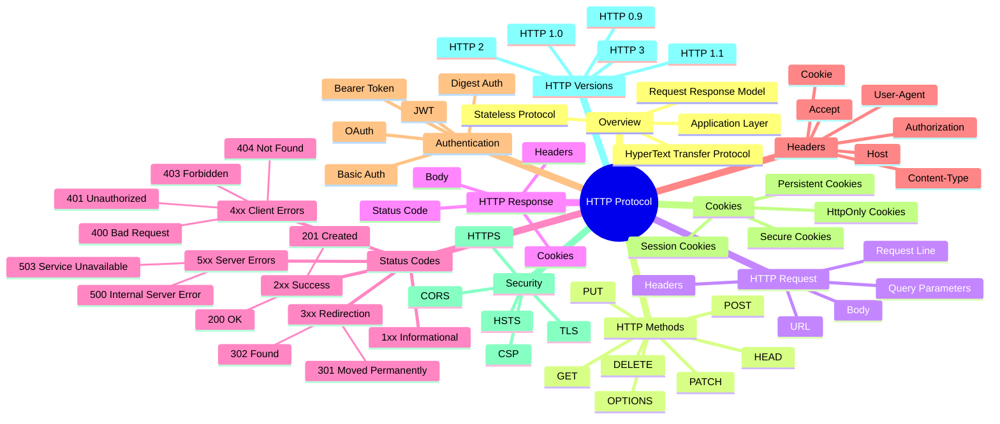
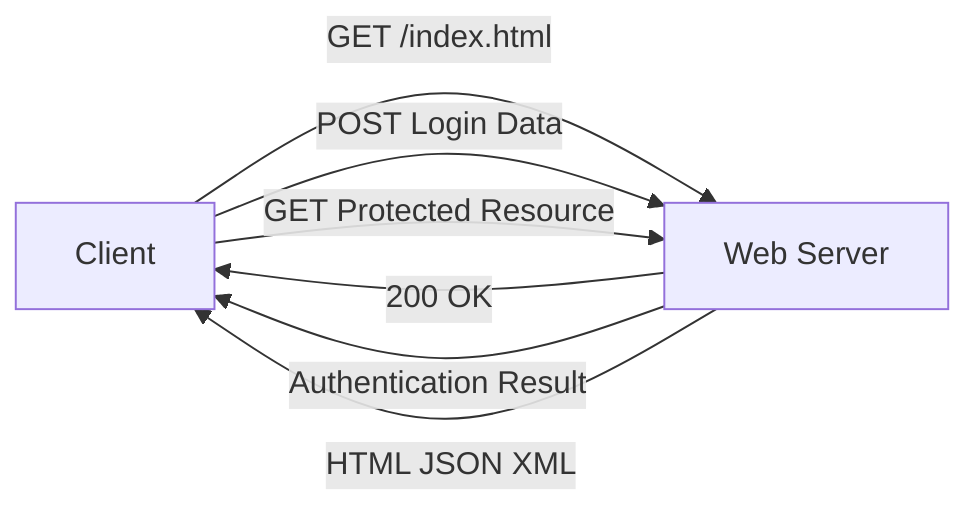

<div align="center">
    <p align="center">
        <a href="https://wikipedia.org/wiki/HTTP">
         
        </a>
    </p>


  
# **`Awesome`** [HTTP](https://www.rfc-editor.org/rfc/rfc1945) Protocol [](https://awesome.re)
</div>

[]() 
[]()

<p align="center">
    <a href="https://github.com/cybersecurity-dev/"></a>
    &nbsp;
    <a href="https://www.youtube.com/@CyberThreatDefense"></a>
    &nbsp;
    <a href="https://cyberthreatdefence.com/my_awesome_lists"></a>
    
</p>

```text
HTTP Protocol
│
├── Methods
│   ├── GET
│   ├── POST
│   ├── PUT
│   ├── DELETE
│   └── PATCH
│
├── Messages
│   ├── Request
│   └── Response
│
├── Headers
│   ├── Host
│   ├── Cookie
│   ├── User-Agent
│   └── Authorization
│
├── Status Codes
│   ├── 1xx Information
│   ├── 2xx Success
│   ├── 3xx Redirect
│   ├── 4xx Client Error
│   └── 5xx Server Error
│
├── Security
│   ├── HTTPS
│   ├── TLS
│   ├── HSTS
│   └── CSP
│
└── Versions
    ├── HTTP/1.0
    ├── HTTP/1.1
    ├── HTTP/2
    └── HTTP/3
```

## 📖 Contents
- [Versions](#versions)
- [My Other Awesome Lists](#my-other-awesome-lists)
- [Contributing](#contributing)
- [Contributors](#contributors)

## Versions



### HTTP/1

### HTTP/2

### HTTP/3

##

### My Other Awesome Lists
You can access the my other awesome lists [here](https://cyberthreatdefence.com/my_awesome_lists)

### Contributing
[Contributions of any kind welcome, just follow the guidelines](contributing.md)!

### Contributors
[Thanks goes to these contributors](https://github.com/cybersecurity-dev/awesome-http-protocol/graphs/contributors)!

### License
[](http://creativecommons.org/publicdomain/zero/1.0)

[🔼 Back to top](#awesome-http-protocol-)
